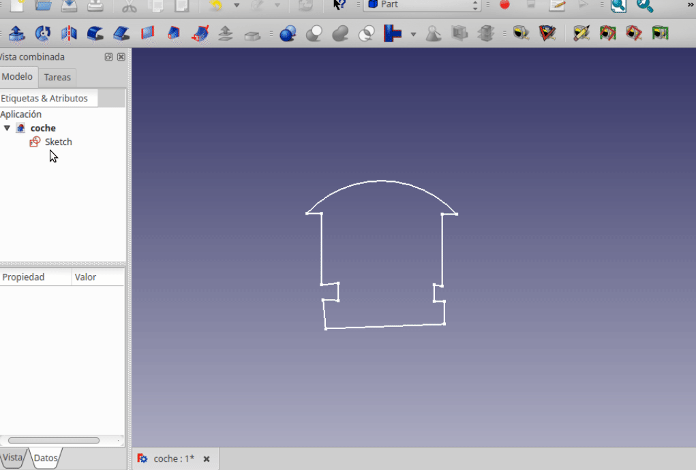
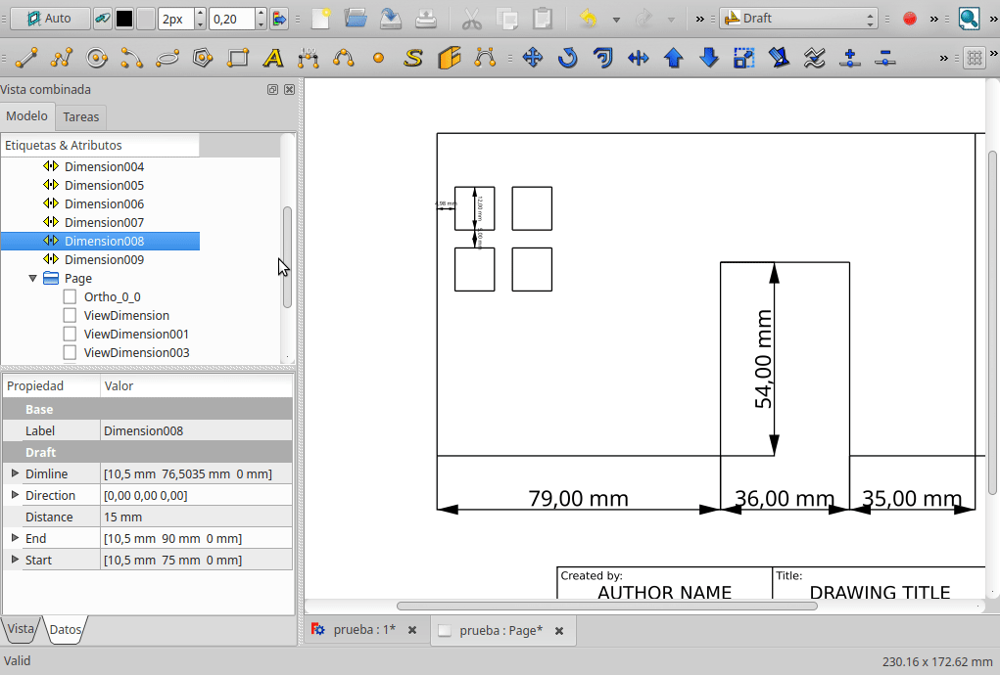
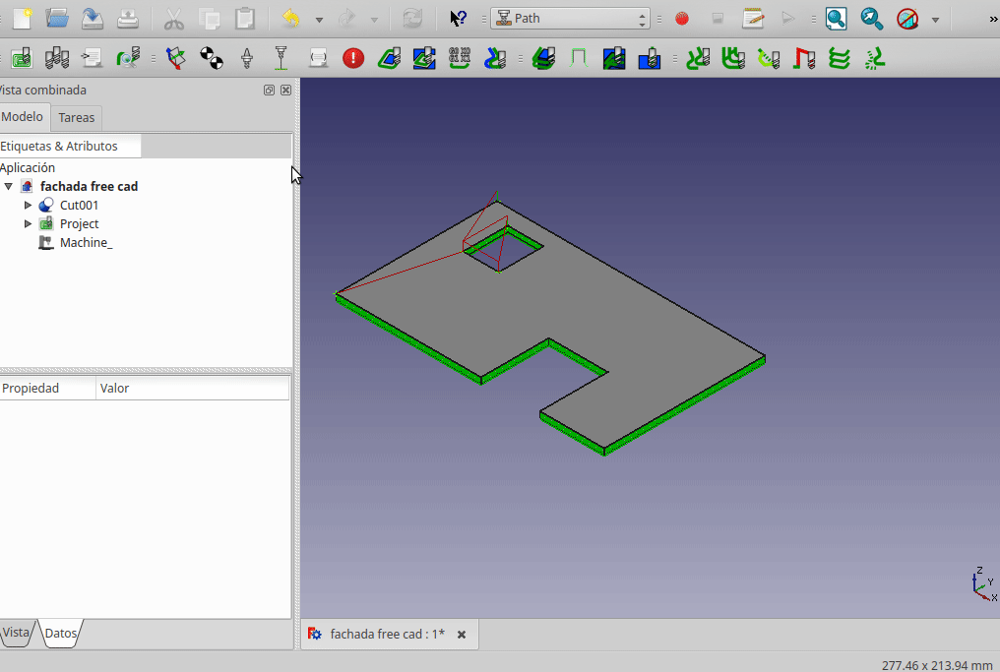
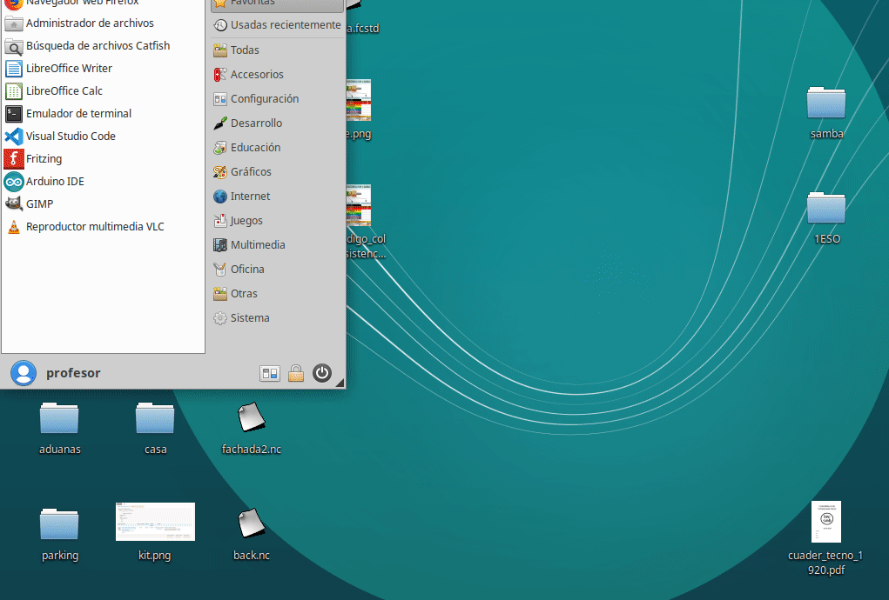

# Extruir croquis

# Acotar las piezas

ES conveniente acotar las piezas diseñadas, sobre todo si se van a construir manualmente.

Freecad tiene opciones en el escenario "Draft". 

Recuerda cumplir las normas de acotación.

# Preparar documento técnico

# Prepando archivo GCODE

## Freecad

IMPORTANTE: Antes de empezar, asegurarse de colocar la cara XY a la altura 0 del eje Z, bajando la figura en este eje el mismo grosor que el tablero (p.e 3 mm)

.gif)

1. Generar trayectos de la máquina CNC.

2. Configurar la máquina CNC.

3. Exportar archivos .gcode.

## Inkscape

# Simulación (CAM)

## CAMotics

1. Simular .gcode

# Instalación servomotores

## Alimentación varios servos SG90

