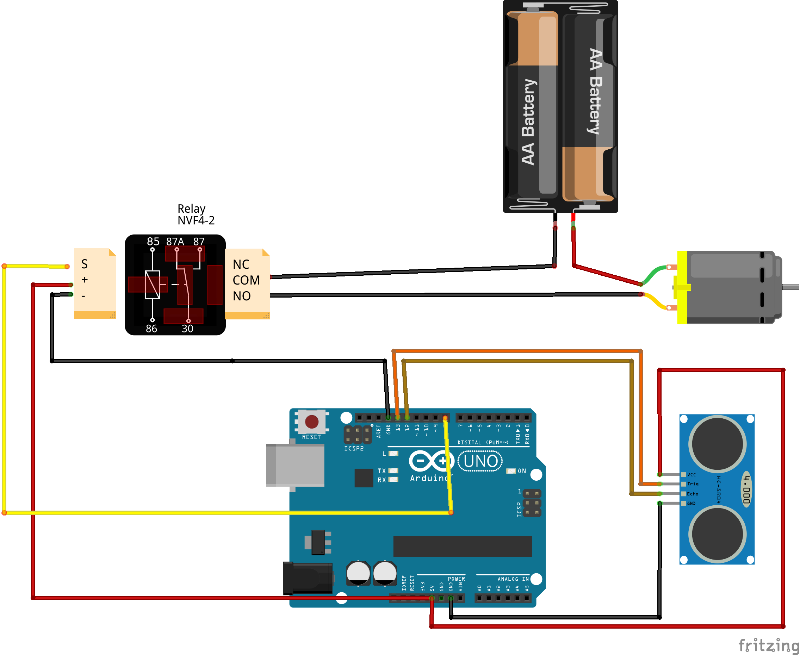
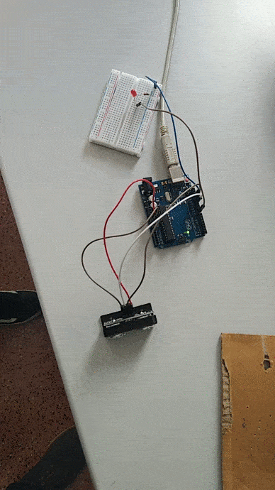

# Descripción

Este proyecto consiste en crear un dispensador automático de gel hidroalcoholico para higienizar las manos cuando se colocan cerca de un sensor de proximidad.

# Materiales

* Arduino
* Sensor HC-SR04
* Relé (compatible con Arduino)
* Bomba de agua (3V-5V)
* Tubo riego
* Depósito de agua
* Portapilas
* Pilas
* Latiguillos

# Diseño

# Esquema eléctrico



## Prueba con LED y con relé




# Programación

## Progamación para comprobar los valores del sensor HC-SR04

```arduino
/**
 * Medidor de distancia
 */

void setup() {
    Serial.begin(9600);
    pinMode(13, OUTPUT);
    pinMode(12, INPUT);
    
    digitalWrite(13, LOW);
}

void loop() {
    digitalWrite(13, HIGH);
    delayMicroseconds(10);
    digitalWrite(13, LOW);
    
    long tiempo;
    tiempo = pulseIn(12, HIGH);
    
    // Velocidad Sonido = 343 m/s
    float distancia = 34300*tiempo*0.000001;
    distancia = distancia / 2;
    
    Serial.print("Distancia: ");
    Serial.println(distancia);
}

```

# Enlaces de ayuda

* https://create.arduino.cc/projecthub/agriculturaelectronica/bomba-de-agua-con-arduino-602930

* https://github.com/robotando/Practicas-ElCableAmarillo/tree/master/medidor-de-distancias

* https://www.youtube.com/watch?v=4KrkhyyxKEY

* https://edprogg.wordpress.com/2020/07/13/tutorial-dispensador-automatizado-de-gel-con-arduino/


