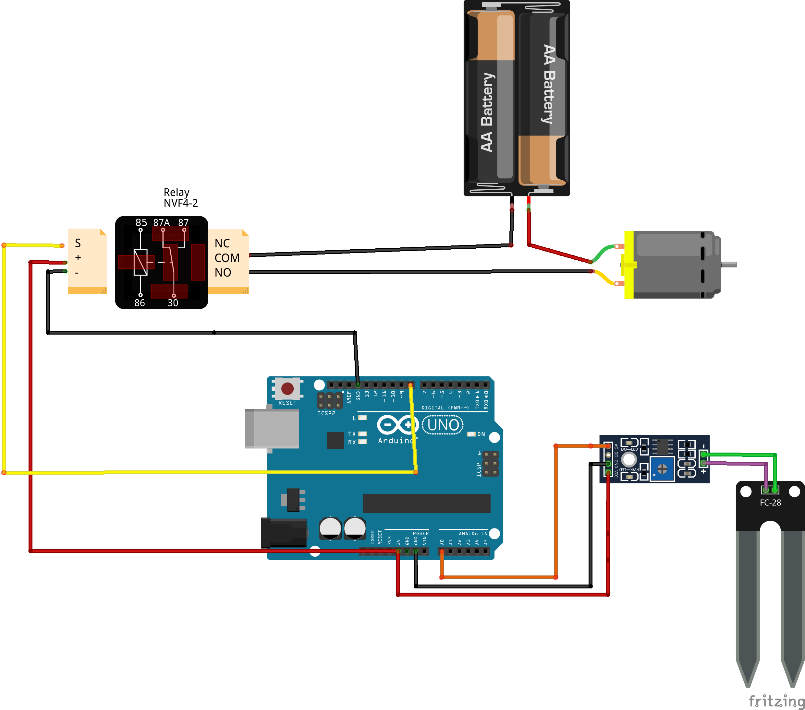

# Descripción

Este proyecto consiste en crear un riego automático para una maceta pequeña con la ayuda de una placa electrónica ARDUINO. La maceta se regará automáticamente cuando la tierra esté seca.

# Materiales

* Arduino
* Sensor HW-080 (con módulo)
* Relé (compatible con Arduino)
* Bomba de agua (3V-5V)
* Tubo riego
* Depósito de agua
* Portapilas
* Pilas
* Latiguillos

# Diseño

# Esquema eléctrico



# Programación

## Progamación para comprobar los valores del sensor HW-080 y artivar un relé

```arduino
int sensor=A0;
int rele=8;
int valorUmbral=10;
int tiempoRiego=2000;
int tiempoentrecheck=10000;
void setup(){
    pinMode(sensor, INPUT);
    pinMode(rele, OUTPUT);
    Serial.begin(9600);
  }
 void loop(){
 //Se hace la lectura analoga del pin A0 (sensor) y se pasa por la funcion map() para ajustar los valores leidos a los porcentajes que queremos utilizar   
int valorHumedad = map(analogRead(sensor), 0, 1023, 100, 0);
Serial.print("Humedad: ");
Serial.print(valorHumedad);
Serial.println("%"); 
 if (valorHumedad < valorUmbral) {
      digitalWrite(rele, HIGH);
      delay(tiempoRiego);
      digitalWrite(rele, LOW);
    }
  else {
      digitalWrite(rele, LOW);

    }
delay(tiempoentrecheck);

  }

```

# Enlaces de ayuda

* https://irisfernandez.com.ar/betaweblog/index.php/2019/11/03/sensor-de-humedad-para-tierra-hw-080/


